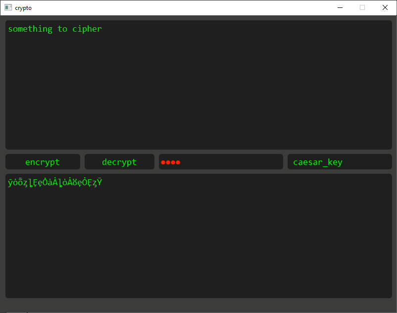

# encryptor

## methods

- caesar cipher

- caesar_key cipher

- trisemus_key cipher

- affine permutation cipher

### description

 this project was writen for educational purposes, it represents some elder encryption methods.
 they have no use in our time, cause they`re very simple and easy to decrypt
 
### author

 finally